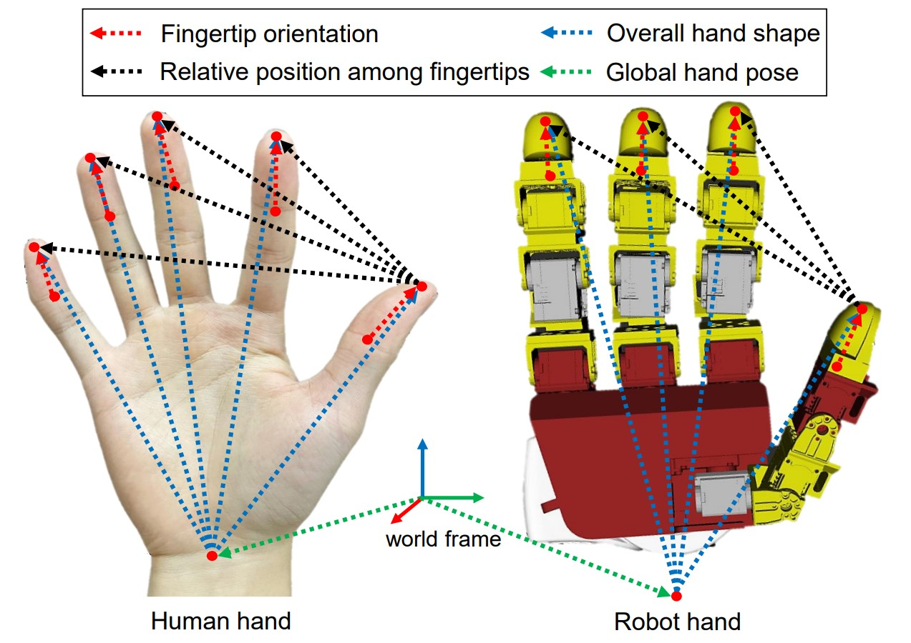

# Analyzing Key Objectives in Human-to-Robot Retargeting for Dexterous Manipulation

[[Project website](https://mingrui-yu.github.io/retargeting/)]

Repository for Paper "Analyzing Key Objectives in Human-to-Robot Retargeting for Dexterous Manipulation".

In this repository, we provide:

- The human-to-robot retargeting algorithm.
- The interface of human hand detection based on RGB image or Apple Vision Pro.
- An Rviz-based visualizer to visualze the retargeting results.

<div align="center">
  
</div>

## Installation

1. Ubuntu 22.04.

1. To use ros2 with conda, the python version of the virtual env must be consistent with the system python. In addition, install Pinocchio when creating the virtual env.

   ```shell
   # e.g., ubuntu 22.04
   conda create -n <your_env_name> -c conda-forge python=3.10.12 pinocchio
   ```

1. Install [PyTorch](https://pytorch.org/).

1. Install:

   ```bash
   pip install numpy
   pip install mujoco
   pip install nlopt
   pip install pynput
   pip install opencv-python
   pip install mediapipe # for RGB-based hand detection
   pip install avp_stream # for Vision-Pro
   ```

1. Install [ROS2 Humble](https://docs.ros.org/en/humble/Installation.html).

1. ROS2 dependencies:

   ```shell
   sudo apt-get install python3-colcon-common-extensions
   sudo apt-get install ros-humble-xacro
   sudo apt-get install ros-humble-robot-state-publisher
   sudo apt-get install ros-humble-joint-state-publisher
   sudo apt-get install ros-humble-joint-state-publisher-gui
   ```

1. Clone this repo: `git clone --recurse-submodules https://github.com/Mingrui-Yu/retargeting.git`

1. (Only for Leap Hand Hardware) Dependence of Leap Hand hardware: refer to [here](ws_ros2/src/leaphand_ros2_module/readme.md).

1. Build the ROS2 workspace:
   ```
   cd ws_ros2
   colcon build --symlink-install
   ```

## Usage

### Teleoperation

```bash
# launch the rviz
ros2 launch retargeting_benchmark rviz_vis_paxini.py

# launch the retargeting module
cd ws_ros2
python src/retargeting_benchmark/src/main_robot_teleoperation.py
```

## Development

If you want to do some customized development, such as adding new robots, please follow these instructions.

### Robot file

1. Place the robot file (.xacro) in `src/my_robot_descriptioin/urdf/`. (We recommend xacro since it supports convenient combination of arms, hands, and fingertip tactile sensors.)

1. Convert from .xacro to .urdf:

   ```bash
   cd ws_ros2
   source install/setup.bash

   # e.g.
   xacro src/my_robot_description/urdf/panda_leap_tac3d.xacro > src/my_robot_description/urdf/panda_leap_tac3d.urdf
   ```

1. (Optional, for mujuco simulation) We use soft link to link [the urdf file generated from xacro in ROS workspace] to [the urdf file used for generating xml in mujoco folder]:

   ```bash
   cd retarget_benchmark
   ln -s ws_ros2/src/my_robot_description/urdf/panda_leap_tac3d.urdf  assets/panda_leap_tac3d.urdf
   ```

1. (Optional, for mujuco simulation) Convert .urdf to .xml and do related modifications:

   ```
   python ws_ros2/src/retargeting_benchmark/src/main_robot_file_process.py
   ```

### Visualize robot urdf in Rviz

Write the Rviz launch file according to the following examples:

```shell
# e.g.,
ros2 launch my_robot_description vis_panda_leap_tac3d.py
ros2 launch my_robot_description vis_panda_leap_paxini.py
```

## Real Robot control

**Notice**: The following hardware setup may only work on the Panda arm + Leap Hand in our lab.

1. unlock robot arm at `192.168.52.3/desk/` and activate FCI;

2. Driver on Franka Control PC:

   ```shell
   ssh robotics@192.168.52.5

   cd franka_emika_panda/ws_ros2/
   source install/setup.bash

   ros2 launch franka_bringup low_level_joint_impedance_controller.launch.py arm_id:=fer robot_ip:=192.168.52.3
   ```

3. Leap hand bringup:

   ```
   conda activate <env>
   ros2 launch leap_hand leap_bringup.py
   ```

4. Real prepare:

   - franka_joint_states_freq_reduce
   - main_robot_real_high_freq

   ```shell
   conda activate <env>
   ros2 launch retargeting_benchmark real_prepare.py
   ```

5. Run your teleoperation scripts.
